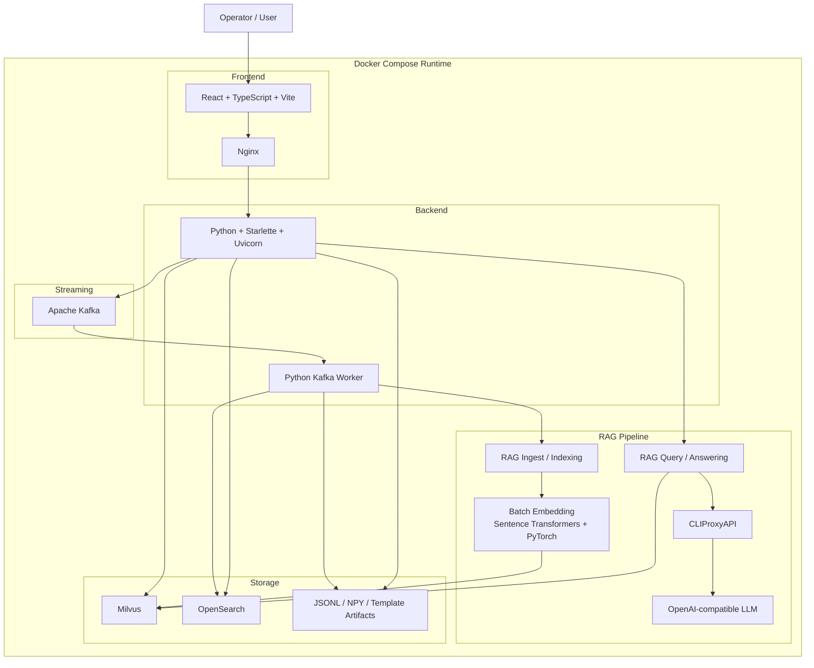
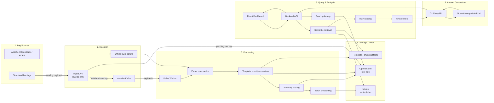
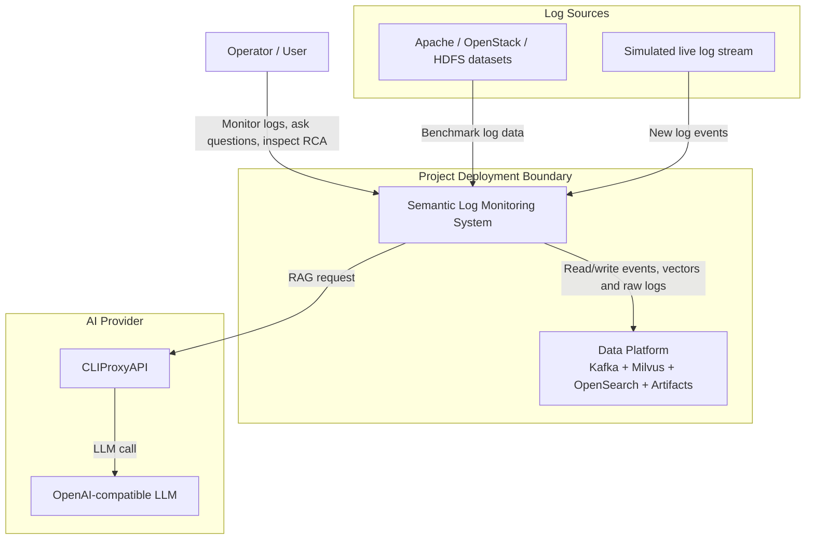
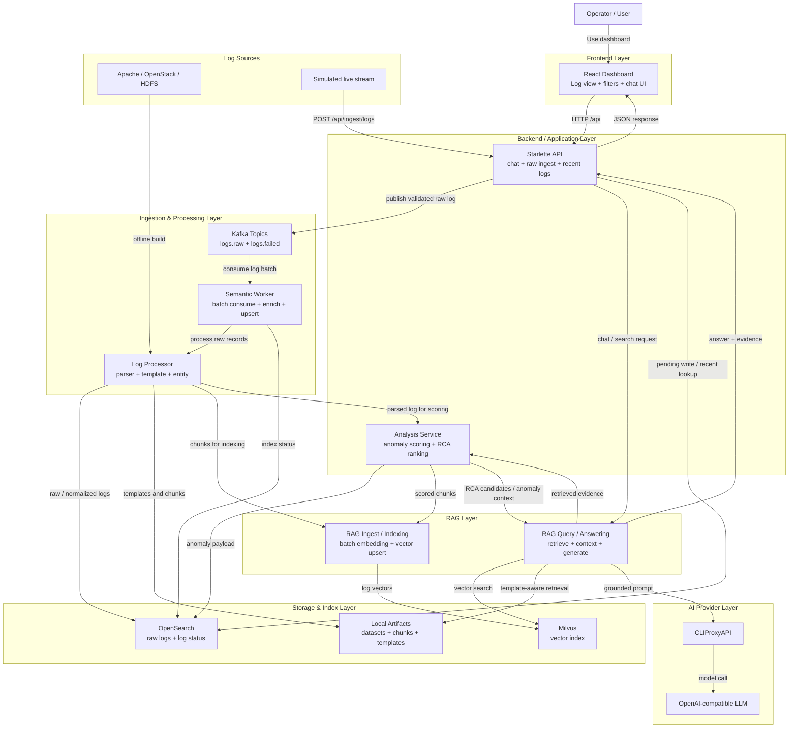

# Semantic Log Monitoring with Anomaly Detection and RCA - C4 Architecture

Tài liệu này mô tả kiến trúc tổng quan của project theo phong cách C4 Model. Cách gộp thành phần được điều chỉnh theo hướng gần với các hệ thống log/observability và RAG thực tế: tách rõ lớp giao diện, backend ứng dụng, ingestion/processing, RAG/analysis, storage/messaging và LLM provider.

## Nguyên tắc gộp thành phần

- **Frontend layer**: gom các phần giao diện người dùng như dashboard, bộ lọc log và chat UI.
- **Backend/Application layer**: gom API, điều phối chat và các chức năng phân tích.
- **RAG layer**: gom hai luồng chính của RAG gồm ingest/indexing và query/answering.
- **Ingestion/Processing layer**: gom Kafka worker, parser, template matching và entity extraction.
- **Storage/Messaging layer**: gom Kafka, Milvus, OpenSearch và local artifacts vì đây là lớp hạ tầng dữ liệu.
- **AI Provider layer**: gom CLIProxyAPI và LLM vì đây là lớp phục vụ sinh câu trả lời cho RAG.

Lý do gộp như vậy là để sơ đồ thể hiện đúng kiến trúc hệ thống thay vì liệt kê quá nhiều module nhỏ. Trong C4, Container Diagram nên ưu tiên các khối có ý nghĩa runtime/deployment hoặc boundary rõ ràng; các hàm/module nội bộ chỉ nên xuất hiện khi chúng giúp giải thích luồng chính.

## Sơ đồ công nghệ tổng quát

Sơ đồ này chỉ thể hiện các công nghệ chính được sử dụng trong project, phù hợp để đưa vào phần tổng quan kiến trúc hoặc phần công nghệ sử dụng của báo cáo.

### Cách đọc sơ đồ

- **React + TypeScript + Vite** là lớp giao diện dashboard.
- **Nginx** phục vụ frontend và chuyển tiếp các request `/api` vào backend.
- **Python + Starlette + Uvicorn** là backend API chính; với luồng ingest, API chỉ nhận log thô và chuẩn hóa nhẹ trước khi đẩy vào Kafka.
- **Apache Kafka** tiếp nhận luồng log mới phát sinh.
- **Python Kafka Worker** đọc log từ Kafka và xử lý dữ liệu trước khi lưu trữ.
- **RAG Ingest / Indexing** là luồng đưa log đã xử lý vào kho truy xuất của RAG.
- **Sentence Transformers + PyTorch** tạo embedding theo batch để phục vụ semantic search và indexing vào Milvus.
- **RAG Query / Answering** là luồng truy xuất evidence, tạo context và gọi LLM để sinh câu trả lời.
- **Milvus** lưu vector embedding của log.
- **OpenSearch** lưu log gốc và hỗ trợ truy xuất log theo điều kiện.
- **JSONL / NPY / Template Artifacts** lưu dữ liệu benchmark, chunk và template registry.
- **CLIProxyAPI + OpenAI-compatible LLM** phục vụ bước sinh câu trả lời trong RAG.

## Luồng dữ liệu tổng thể

Sơ đồ này mô tả dữ liệu đi qua hệ thống từ lúc log được đưa vào, xử lý, lưu trữ, cho đến khi người dùng truy vấn và nhận kết quả phân tích.

### Diễn giải luồng dữ liệu

**1. Luồng ingest/indexing**

- Log đến từ hai nguồn: dữ liệu mẫu Apache/OpenStack/HDFS hoặc luồng log mô phỏng.
- Dữ liệu mẫu được xử lý bằng các offline build scripts.
- Log mới phát sinh đi qua Ingest API dưới dạng raw log payload. API chỉ kiểm tra JSON, chuẩn hóa các trường cơ bản, ghi trạng thái `pending` vào OpenSearch và publish message vào Kafka.
- Kafka Worker đọc log từ Kafka theo batch và đưa vào pipeline xử lý semantic.
- Log được parse, chuẩn hóa, nhận diện template, trích xuất entity và chấm điểm bất thường ở worker/processor, không phải ở API ingest.
- Các chunk sau xử lý được gom batch để tạo embedding trước khi ghi vào Milvus.
- Log gốc, metadata cơ bản và trạng thái index được lưu vào OpenSearch để dashboard có thể xem lại và debug ingest.
- Vector embedding được lưu vào Milvus.
- Template, chunk và registry artifacts được lưu ở local files để phục vụ retrieval và benchmark.

**2. Luồng query/analysis**

- Người dùng thao tác trên React Dashboard và gửi request đến Backend API.
- Backend thực hiện semantic retrieval bằng cách truy xuất Milvus và template artifacts.
- OpenSearch được dùng cho truy xuất log gốc, recent logs hoặc kiểm tra lại nội dung log, không phải nguồn tìm kiếm ngữ nghĩa chính.
- Nếu người dùng yêu cầu phân tích sự cố, RCA ranking chọn các log liên quan làm evidence.
- RAG context được tạo từ các log/evidence đã truy xuất.
- Backend gửi context qua CLIProxyAPI để gọi LLM.
- Câu trả lời và evidence được trả về Dashboard.

**3. Lý do thiết kế luồng**

- Luồng ingest và luồng query được tách riêng để hệ thống có thể xử lý log liên tục mà không phụ thuộc trực tiếp vào thao tác của người dùng.
- Kafka giúp hấp thụ log mới phát sinh và cho phép worker xử lý log, embedding, upsert theo batch.
- Milvus và OpenSearch được dùng song song nhưng phục vụ hai mục đích khác nhau: Milvus cho semantic search, OpenSearch cho raw log lookup và filter theo trường.
- RAG chỉ sinh câu trả lời sau khi đã có evidence từ storage, giúp câu trả lời bám vào dữ liệu log thay vì chỉ dựa vào kiến thức chung của LLM.

## 1. Context Diagram

Mục tiêu của sơ đồ context là thể hiện hệ thống nằm trong bối cảnh nào, ai sử dụng hệ thống, dữ liệu đến từ đâu và hệ thống phụ thuộc vào dịch vụ AI nào.

### Giải thích

**Vai trò các thành phần**

- **Operator/User**: người dùng chính của hệ thống, theo dõi log, đặt câu hỏi, xem bất thường và kiểm tra RCA candidates.
- **Log Sources**: gồm dữ liệu mẫu Apache/OpenStack/HDFS và luồng log mới phát sinh được mô phỏng.
- **Semantic Log Monitoring System**: hệ thống chính, bao gồm dashboard, backend API, xử lý log, tìm kiếm ngữ nghĩa, RAG, anomaly detection và RCA.
- **Data Platform**: lớp hạ tầng dữ liệu của project, gồm Kafka cho streaming, Milvus cho vector search, OpenSearch cho raw logs và local artifacts cho template/benchmark.
- **CLIProxyAPI / LLM**: lớp phục vụ sinh câu trả lời RAG dựa trên context đã truy xuất.

**Luồng dữ liệu chính**

1. Operator truy cập hệ thống qua dashboard.
2. Hệ thống nhận dữ liệu từ dataset mẫu hoặc luồng log mô phỏng.
3. Log được xử lý, lưu vào lớp Data Platform và được dùng cho dashboard, retrieval, anomaly và RCA.
4. Khi người dùng hỏi đáp, hệ thống truy xuất log liên quan rồi gọi LLM thông qua CLIProxyAPI.

**Lý do thiết kế**

- Context Diagram chỉ giữ các khối lớn để người đọc hiểu hệ thống trong bối cảnh tổng thể.
- Kafka, Milvus, OpenSearch và artifacts được gộp thành **Data Platform** vì ở mức context, chúng là hạ tầng dữ liệu hỗ trợ hệ thống thay vì logic nghiệp vụ riêng lẻ.
- CLIProxyAPI được tách khỏi hệ thống chính để thể hiện rõ dependency với mô hình ngôn ngữ lớn.

## 2. Container Diagram

Mục tiêu của sơ đồ container là thể hiện các container/lớp thành phần chính trong hệ thống và luồng dữ liệu giữa chúng. Sơ đồ này gộp các module nhỏ thành các nhóm có ý nghĩa kiến trúc để dễ đọc và dễ đưa vào báo cáo.

### Giải thích

**Vai trò các lớp thành phần**

- **Frontend Layer**: chứa React Dashboard và Chat UI. Đây là điểm tương tác chính của operator, dùng để xem log, lọc dữ liệu, hỏi đáp và xem kết quả phân tích.
- **Backend / Application Layer**: chứa Starlette API và các service nghiệp vụ chính. API nhận request từ dashboard; Analysis Service gom anomaly scoring và RCA ranking.
- **RAG Layer**: gồm hai luồng chính. RAG Ingest/Indexing nhận chunk log đã xử lý, tạo embedding theo batch và ghi vector vào Milvus. RAG Query/Answering truy xuất evidence, xây dựng context và gọi LLM để sinh câu trả lời.
- **Ingestion & Processing Layer**: xử lý log đầu vào. Kafka nhận raw log đã được API kiểm tra cơ bản, Semantic Worker đọc log theo batch, còn Log Processor chuẩn hóa log, nhận diện template/entity và chuyển dữ liệu sang RAG Ingest.
- **Storage & Index Layer**: lưu trữ dữ liệu đã xử lý. OpenSearch giữ log gốc và trạng thái index, Milvus giữ vector embedding, còn local artifacts giữ dataset/chunk/template phục vụ benchmark và retrieval.
- **AI Provider Layer**: chứa CLIProxyAPI và LLM. Backend không gọi LLM trực tiếp từ frontend mà đi qua lớp proxy để dễ cấu hình endpoint/model.

**Luồng dữ liệu chính**

1. **Offline dataset flow**: Apache/OpenStack/HDFS được xử lý qua Log Processor, sau đó ghi raw logs vào OpenSearch, template/chunk vào local artifacts và đưa chunk sang RAG Ingest để tạo vector trong Milvus.
2. **Streaming ingest flow**: live stream mô phỏng gửi raw log vào API, API kiểm tra và publish message vào Kafka, Semantic Worker đọc theo batch, Log Processor chuẩn hóa và trích xuất template/entity, sau đó RAG Ingest/Indexing tạo embedding theo batch và ghi vector vào Milvus.
3. **Query/RAG flow**: dashboard gửi câu hỏi vào API, API gọi RAG Query/Answering, RAG truy xuất evidence từ Milvus và template artifacts, sau đó gọi LLM qua CLIProxyAPI để tạo câu trả lời.
4. **Analysis flow**: các chức năng anomaly scoring và RCA ranking được gom trong Analysis Service để hỗ trợ RAG và dashboard bằng evidence có cấu trúc.

**Lý do thiết kế**

- Cách gộp này giống các hệ thống observability thực tế: giao diện, ingestion pipeline, search/storage và analytics được tách thành các lớp rõ ràng.
- Kafka nằm giữa API và worker để giảm coupling giữa nguồn log và xử lý phía sau, đồng thời hỗ trợ batch processing và khả năng mở rộng consumer.
- Milvus và OpenSearch được tách riêng vì chúng tối ưu cho hai nhu cầu khác nhau: Milvus cho semantic vector search, OpenSearch cho raw log lookup, recent logs và filter theo trường.
- RAG được tách thành hai luồng **Ingest/Indexing** và **Query/Answering** vì đây là cấu trúc phổ biến của hệ thống RAG thực tế: một luồng chuẩn bị tri thức, một luồng truy vấn và sinh câu trả lời.
- Analysis Service gom anomaly và RCA vì cả hai đều là logic phân tích trên log đã xử lý, không phải hạ tầng lưu trữ hay giao diện.
- Local artifacts vẫn được thể hiện vì project có template registry, chunk files và benchmark files thật; tuy nhiên chúng được đặt trong Storage & Index Layer để không làm sơ đồ bị vụn.

## Ghi chú phạm vi

- `Kafka`, `Milvus`, `OpenSearch` và `CLIProxyAPI` là các service được cấu hình trong `docker-compose.yml`.
- `RAG Layer`, `Analysis Service` và `Log Processor` là cách gom các module Python hiện có, không phải container Docker riêng.
- `ANOMALY_ENABLED` quyết định việc worker có gắn anomaly payload trong luồng streaming hay không.
- Sơ đồ không đưa chi tiết nội bộ của Milvus như etcd và MinIO để giữ đúng mức container tổng quan.

## Tham khảo thiết kế

- [C4 Model](https://c4model.com/) cho cách phân tầng System Context và Container Diagram.
- [Apache Kafka Documentation](https://kafka.apache.org/documentation/) cho mô hình topic, producer/consumer và streaming pipeline.
- [OpenSearch Documentation](https://docs.opensearch.org/latest/getting-started/intro/) cho cách tổ chức ingest, search, dashboard và log analytics.
- [Milvus Documentation](https://milvus.io/docs/overview.md) cho vector database, deployment modes và khả năng mở rộng vector search.
- [AWS SageMaker RAG Documentation](https://docs.aws.amazon.com/sagemaker/latest/dg/jumpstart-foundation-models-customize-rag.html) cho mô hình retrieval-augmented generation.
